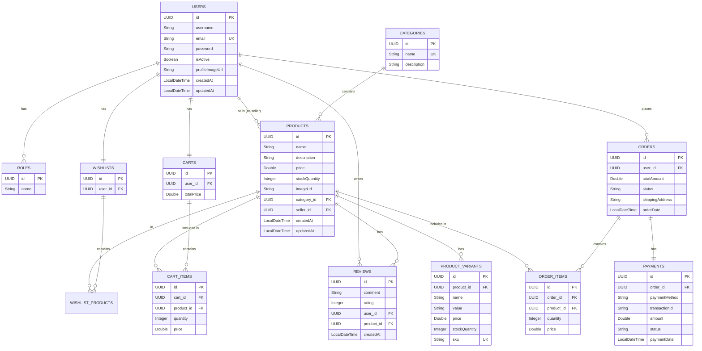

# Database Schema Visualization

This document visualizes the database schema for the ShopStack Pro application using Mermaid.js.

## Entity Details

### User
*   **id**: UUID (Primary Key)
*   **username**: String (Max 20)
*   **email**: String (Max 50, Unique)
*   **password**: String (Max 120)
*   **isActive**: Boolean
*   **profileImageUrl**: String
*   **roles**: Many-to-Many relationship with Role

### Role
*   **id**: UUID (Primary Key)
*   **name**: Enum (ROLE_USER, ROLE_SELLER, ROLE_ADMIN)

### Product
*   **id**: UUID (Primary Key)
*   **name**: String
*   **description**: String (Max 1000)
*   **price**: Double
*   **stockQuantity**: Integer
*   **imageUrl**: String (Max 500)
*   **category**: Many-to-One relationship with Category
*   **seller**: Many-to-One relationship with User
*   **variants**: One-to-Many relationship with ProductVariant

### Category
*   **id**: UUID (Primary Key)
*   **name**: String (Unique)
*   **description**: String

### Order
*   **id**: UUID (Primary Key)
*   **user**: Many-to-One relationship with User
*   **items**: One-to-Many relationship with OrderItem
*   **totalAmount**: Double
*   **status**: Enum (PENDING, PAID, SHIPPED, DELIVERED, CANCELLED)
*   **shippingAddress**: String
*   **orderDate**: LocalDateTime

### Cart
*   **id**: UUID (Primary Key)
*   **user**: One-to-One relationship with User
*   **items**: One-to-Many relationship with CartItem
*   **totalPrice**: Double

### Review
*   **id**: UUID (Primary Key)
*   **comment**: String
*   **rating**: Integer (1-5)
*   **user**: Many-to-One relationship with User
*   **product**: Many-to-One relationship with Product

### Payment
*   **id**: UUID (Primary Key)
*   **order**: One-to-One relationship with Order
*   **paymentMethod**: String
*   **transactionId**: String
*   **amount**: Double
*   **status**: String

### Wishlist
*   **id**: UUID (Primary Key)
*   **user**: One-to-One relationship with User
*   **products**: Many-to-Many relationship with Product

## 🔗 Relationships

### User Relationships
*   **User ↔ Role (Many-to-Many)**: A user can have multiple roles (e.g., User and Seller), and a role can be assigned to multiple users. Managed via `user_roles` join table.
*   **User ↔ Cart (One-to-One)**: Each user has exactly one active shopping cart.
*   **User ↔ Wishlist (One-to-One)**: Each user has exactly one wishlist.
*   **User ↔ Order (One-to-Many)**: A user can place multiple orders over time.
*   **User ↔ Product (One-to-Many)**: A user (specifically a Seller) can list multiple products.
*   **User ↔ Review (One-to-Many)**: A user can write reviews for multiple products.

### Product Relationships
*   **Product ↔ Category (Many-to-One)**: A product belongs to a single category.
*   **Product ↔ User (Many-to-One)**: A product is sold by a specific seller (User).
*   **Product ↔ ProductVariant (One-to-Many)**: A product can have multiple variants (e.g., different sizes or colors).
*   **Product ↔ Review (One-to-Many)**: A product can have multiple customer reviews.
*   **Product ↔ OrderItem (One-to-Many)**: A product can be included in many different orders.
*   **Product ↔ CartItem (One-to-Many)**: A product can be in many users' carts.
*   **Product ↔ Wishlist (Many-to-Many)**: A product can be in multiple users' wishlists.

### Order Relationships
*   **Order ↔ User (Many-to-One)**: An order belongs to the user who placed it.
*   **Order ↔ OrderItem (One-to-Many)**: An order consists of multiple line items (specific products and quantities).
*   **Order ↔ Payment (One-to-One)**: An order has one associated payment transaction.

### Cart Relationships
*   **Cart ↔ User (One-to-One)**: A cart belongs to a specific user.
*   **Cart ↔ CartItem (One-to-Many)**: A cart contains multiple items.

### Review Relationships
*   **Review ↔ User (Many-to-One)**: A review is written by a specific user.
*   **Review ↔ Product (Many-to-One)**: A review is for a specific product.
